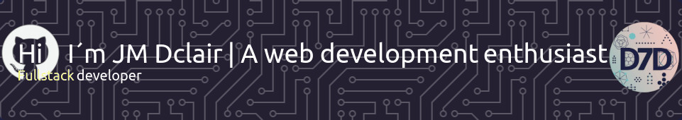

# 
## I´m studying full stack web application development
- 🔭 I’m currently working as a computer science teacher in a PFAE project (in Gran Canaria , Canary Island - Spain).
- 🌱 I’m currently learning Full Stack Web Development.
- 👯 I’m looking to collaborate on HMTL, CSS... proyects.
- 🤔 I’m looking for help with ALL!!! (😄).
- 📫 How to reach me: jmdclair@gmail.com

## Mis primeros proyectos de aprendizaje CSS | My first CSS learning proyects
- Header Bussines Agency (maquetación CSS para Desktop, no responsive).
- Header Creative Agency(maquetación CSS para Desktop, no responsive).
- Header Coworking Space (maquetación CSS para Desktop, no responsive).
- Header NFT Marketplace (maquetación CSS para Desktop, no responsive).
- Header Grocery Store (maquetación CSS para Desktop, no responsive).
- Header Elearning Landing Page | Smartphone (maquetación CSS RESPONSIVE).
  
   
- Header Elearning Landing Page | Tablet (maquetación CSS RESPONSIVE).
- Header Elearning Landing Page | Desktop (maquetación CSS RESPONSIVE).

  # Mis pages | My pages
  - Spa & Beauty
    [GitHub Pages](https://dclair.github.io/CSS_spa-beauty/)
  - .

<!--
**dclair/dclair** is a ✨ _special_ ✨ repository because its `README.md` (this file) appears on your GitHub profile.

Here are some ideas to get you started:

- 🔭 I’m currently working on ...
- 🌱 I’m currently learning ...
- 👯 I’m looking to collaborate on ...
- 🤔 I’m looking for help with ...
- 💬 Ask me about ...
- 📫 How to reach me: ...
- 😄 Pronouns: ...
- ⚡ Fun fact: ...
-->
